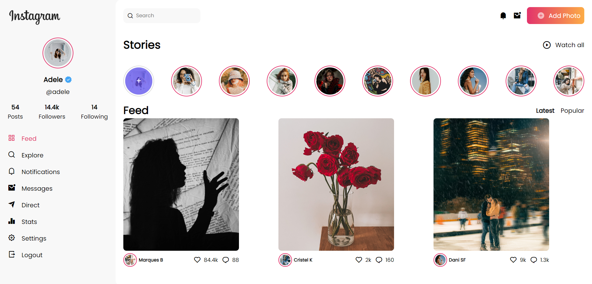

# Instagram Redesign

Este proyecto es una página web que tiene un diseño parecido al de Instagram. Es un rediseño y no es responsive.

Tiene diferentes secciones como:

- Sidebar
- Profile Image
- About
- Menu
- Main Home
- Stories
- Posts

Se pueden usar imágenes alternativas en caso de que se desee personalizar el contenido.

## Funcionamiento:

## Tecnologías
- HTML
- CSS

Además, se incluyeron **Google Fonts** para personalizar la fuente, **Remix Icon** para incorporar íconos y **Pexels** para las imágenes usadas.
